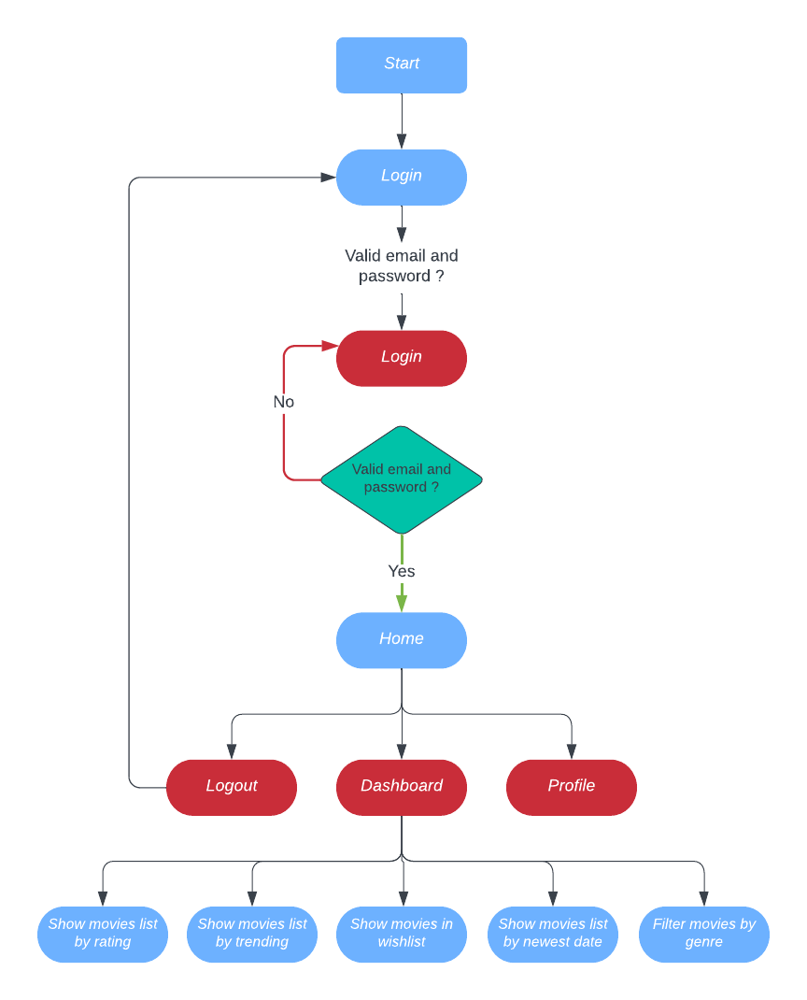

# Library Management

## Overview

* This document provides information about ReactJS Practice One to Build a website for Library Management.
* Design: 
  + Mentee thinks and picks designs to adapt to the requirements
  + Base on this design: [Figma](https://www.figma.com/file/T4xdx9pee7N0GxdXpTiAHYEy/the-movie-box-landing-page---Dribbble-Image?node-id=0%3A2&t=B7euMaTbGFhpoyTr-0)

## Targets

* Apply knowledge learned about:
  + Form validation
  + Asynchronous
  + Data manipulation
  + React Hooks
  + Lifecycle component
  + Storybook
  + TypeScript

## Requirements

* Build the application with the features below:
  + Build admin dashboard page manage the list of books, members and hire requests.
  + Admin can add/edit/remove books
  + Admin can add/edit/complete hire requests
  + Each member can hire up to 5 books.
  + Each book can only be hired for up to 10 days.
  + Highlight the hire requests that are overdue date
  + Completed hire requests can not be edited
  + Delete action requires confirmation
  + Validate on each form controls

* Role: 
  + Admin 
  + Member

## Information

* Timeline
  + Estimate time: 8 days (Mar 20, 2023 - Mar 29, 2023)
  + Actual time: … days

* Techniques:
  + HTML5/CSS3 [Latest](https://html.spec.whatwg.org/multipage/)
  + TypeScript [ver 5.0.2](https://www.typescriptlang.org/)
  + JSON Server [ver 0.17.2](https://github.com/typicode/json-server)
  + ReactJS [ver 18.2.0](https://legacy.reactjs.org/)
  + Storybook [ver 6.5](https://storybook.js.org/)
  + Eslint [ver 8.36.0](https://eslint.org/docs/latest/use/getting-started#quick-start)
  + Prettier [ver 2.8.5](https://prettier.io/)
  + Husky [ver 8.0.3](https://typicode.github.io/husky/#/)
  + CommitLint [ver 17.4.4](https://commitlint.js.org/#/)

* Editor: Visual Studio Code.

## Development Environment

* Certainly! To run this website, you will need to have the following tools installed:
  + Node [v16.19.1](https://nodejs.org/en/)
  + pnpm [v7.29.0](https://pnpm.io/installation)
  
* You can download Node.js from their official website and pnpm can be installed globally by running the command:
  ```
  npm install -g pnpm
  ```
* Once you have these tools installed, you can follow the steps provided in the "Getting Started" section to clone the repository, install the necessary packages, and start the development server.

## Main App Features

  - 

## Getting Started

* Step 1: Clone repository

* With HTTPS : 
  ```
  git clone https://gitlab.asoft-python.com/giang.nguyen/reactjs-training.git
  ```
* With SSH:
  ```
  git clone git@gitlab.asoft-python.com:giang.nguyen/reactjs-training.git
  ```

* Step 2: Move to branch typescript-practice-one
  ```
  git checkout practice-one
  ```

* Step 3: Move to folder
  ```
  cd practice-one/library-management
  ```

* Step 4: Now you need to install packages
  ```
  pnpm i
  ```

* Step 5: After installing the packages
  ```
  pnpm start
  ```

* Step 6: Open [localhost](http://localhost:5173) to see the website

## How to run the Storybook

* Build the Storybook with this command
  ```
  pnpm run build-storybook
  ```

* Start the Storybook with this command
  ```
  pnpm run storybook
  ```
* View the Storybook on port: `http://localhost:6006`
