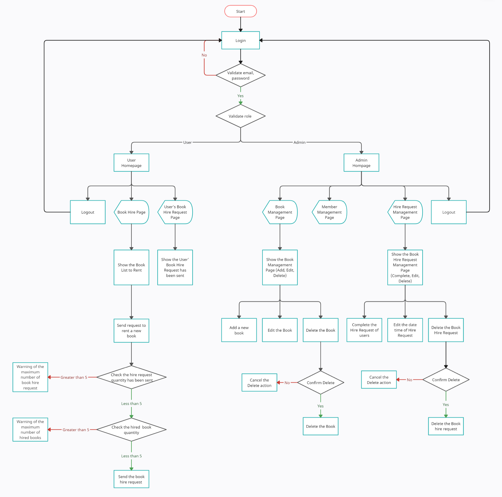

# Library Management

## Overview

- This document provides information about ReactJS Practice One to Build a website for Library Management.
- Design:
  - Mentee thinks and picks designs to adapt to the requirements
  - Base on this design: [Figma](https://www.figma.com/file/MjkP2qhIPf1wgDBtjTo0dQ/charity-homepage-whilecreative?type=design&node-id=0-2&t=TdaRUy6TUPlGDbe2-0)

## Targets

- Apply knowledge learned about:
  - Form validation
  - Asynchronous
  - Data manipulation
  - React Hooks
  - Lifecycle component
  - Storybook
  - TypeScript

## Requirements

- Build the application with the features below:

  - Build admin dashboard page manage the list of books, members and hire requests.
  - Admin can add/edit/remove the books
  - Admin can add/edit/complete the hire requests
  - Each member can hire up to five books and send up to five book requests.
  - Each book can only be rented for a maximum of 10 days from the date of rental start.
  - Highlight the hire book requests that are overdue.
  - Completed hire book requests from the user. When the hire request is marked as completed, the hired book quantity will be +1.
  - Delete action requires confirmation
  - Validate on each form controls

- Role:
  - Admin
  - Member

## Information

- Timeline

  - Estimate time: 8 days (Mar 20, 2023 - Mar 29, 2023)
  - Actual time: ... days

- Techniques:

  - HTML5/CSS3 [Latest](https://html.spec.whatwg.org/multipage/)
  - TypeScript [ver 5.0.2](https://www.typescriptlang.org/)
  - JSON Server [ver 0.17.2](https://github.com/typicode/json-server)
  - ReactJS [ver 18.2.0](https://react.dev)
  - Storybook [ver 7.0.9](https://storybook.js.org/)
  - Eslint [ver 8.36.0](https://eslint.org/docs/latest/use/getting-started#quick-start)
  - Prettier [ver 2.8.5](https://prettier.io/)
  - Husky [ver 8.0.3](https://typicode.github.io/husky/#/)
  - CommitLint [ver 17.4.4](https://commitlint.js.org/#/)

- Editor: Visual Studio Code.

## Development Environment

- Certainly! To run this website, you will need to have the following tools installed:
  - Node [v20.2.0](https://nodejs.org/en/)
  - pnpm [v8.5.1](https://pnpm.io/installation)
- You can download Node.js from their official website and pnpm can be installed globally by running the command:
  ```
  npm install -g pnpm
  ```
- Once you have these tools installed, you can follow the steps provided in the "Getting Started" section to clone the repository, install the necessary packages, and start the development server.

## UserFlow Diagram



## Getting Started

- Step 1: Clone repository

- With HTTPS :
  ```
  git clone https://gitlab.asoft-python.com/giang.nguyen/reactjs-training.git
  ```
- With SSH:

  ```
  git clone git@gitlab.asoft-python.com:giang.nguyen/reactjs-training.git
  ```

- Step 2: Move to branch feature/implement-hire-request-sent-management-page

  ```
  git checkout feature/implement-hire-request-sent-management-page
  ```

- Step 3: Move to folder

  ```
  cd practice-one/library-management
  ```

- Step 4: Now you need to install packages

  ```
  pnpm i
  ```

- Step 5: After installing the packages

  ```
  pnpm start
  ```

- Step 6: Open [localhost](http://localhost:5173) to see the website

## How to run the Storybook

- Build the Storybook with this command

  ```
  pnpm run build-storybook
  ```

- Start the Storybook with this command
  ```
  pnpm run storybook
  ```
- View the Storybook on port: `http://localhost:6006`

## The account for testing

- Account for Administrator:

  - Email: admin@gmail.com
  - Password: 123

- Account for User:
  - Email: user@gmail.com
  - Password: 123
